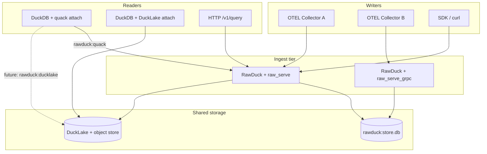

# RawDuck distribution — plan

Multi-host setups: **many OTEL (or HTTP/gRPC) writers** and **many DuckDB query clients** sharing one
logical dataset.

## Primary architecture (DuckLake-first)

**Writers:** N independent RawDuck instances (`raw_serve` / gRPC / batch `raw_ingest`), each shredding
OTLP into typed columns and evolving schema on ingest.

**Storage:** shared [DuckLake](https://ducklake.select) catalog (sqlite metadata + local `DATA_PATH`
for now; S3/postgres metadata later).

**Readers:** M DuckDB clients attach DuckLake **directly** (typically `READ_ONLY`) — no Quack hop
required for analytics.

```sql
-- each writer hub (process 1..N)
INSTALL ducklake; LOAD ducklake;
ATTACH 'ducklake:/data/shared.ducklake' AS lake (DATA_PATH '/data/parquet');
SELECT * FROM raw_serve(
    host := '0.0.0.0', port := 9999, token := 'secret',
    ingest_prefix := 'lake.main'   -- routes otel_traces → lake.main.otel_traces
);

-- OTEL collectors → http://writer-host:9999/otlp/v1/traces

-- reader (separate host/process)
ATTACH 'ducklake:/data/shared.ducklake' AS lake (DATA_PATH '/data/parquet', READ_ONLY);
SELECT "resource.service.name", count(*) FROM lake.main.otel_traces GROUP BY 1;
```

| Setting / param | Purpose |
|---|---|
| `rawduck_ingest_prefix` | Prefix bare targets (`otel_traces` → `lake.main.otel_traces`) |
| `raw_serve(..., ingest_prefix := 'lake.main')` | Sets prefix at database level for all HTTP/gRPC requests |
| Cross-process schema lock | `*.rawduck_schema.lock` beside DuckLake metadata during DDL |

**Sqlite DuckLake constraint:** only one process may hold a persistent `ATTACH` on the metadata
file at a time. Patterns that work today:

| Pattern | Writers | Notes |
|---|---|---|
| **Sequential writer processes** | N processes, each attach → ingest → exit | Validated (`run_ducklake_otel_cluster.sh`) |
| **Single long-lived hub** | N OTEL collectors → one `raw_serve` | Parallel HTTP OK; one metadata lock holder |
| **Concurrent long-lived hubs** | N `raw_serve` on same sqlite lake | **Blocked** by metadata file lock |
| **Postgres DuckLake metadata** | N always-on hubs | Future — removes sqlite exclusivity |

Quack remains optional for remote SQL / ingest lane when readers cannot mount the lake path.

## Target topologies



| Topology | Writers | Readers | Shared state | Status |
|---|---|---|---|---|
| **A. Single ingest hub** | N → one `raw_serve` / gRPC | M via Quack or HTTP query | One DuckDB process + file | Partially tested |
| **B. Quack fan-out** | N → hub (HTTP/gRPC/SQL) | M `ATTACH rawduck:quack:…` | Server-side store | `raw_quack.test` (happy path) |
| **C. DuckLake lakehouse** | N processes → `raw_ingest('lake.…')` | M read-only DuckLake attach | Metadata + parquet on S3/disk | `ducklake.test` (single process) |
| **D. Hybrid hub → lake** | N → hub writing DuckLake backend | M DuckLake read-only attach | DuckLake snapshots | **Validated** (sequential multi-process) |

**Design bet for scale-out:** topology **D** — one or few RawDuck ingest hubs (schema evolution,
OTLP transforms, adaptive layout) backed by **DuckLake** for durable shared storage; readers attach
DuckLake directly for analytics or Quack for RawDuck-aware remote SQL.

Quack remains the convenient **query/control plane** when clients need `raw.ingest.*`, remote
`raw_ingest`, or a stable SQL surface without mounting object storage.

## What we know today

### Single process, many connections (hub A)

- `raw_serve` / gRPC: **one Connection per request** (own transaction). Many concurrent writers on
  the same host are supported at the DuckDB level.
- Default **sync** ingest: row visible when HTTP returns — good for insert-then-query clients.
- Opt-in **async** (`async := true`, `rawduck_async_insert`): coalesces small writes; readers need
  `raw_flush()` or eventual flush (~200 ms) for visibility.
- Schema evolution (`ALTER TABLE`) under concurrent writers is **not serialized** today — wide-schema
  churn from parallel HTTP posts can race (same risk as `rawduck_pipeline_consumers > 1`).

### Quack remote attach (topology B)

- Server: `quack_serve` + RawDuck loaded; canonical store lives on server.
- Client: `ATTACH 'rawduck:quack:host:port' AS raw (TOKEN '…')` — catalog type `rawduck`, ingest
  lane forwards to remote `raw_ingest` via RPC (`raw_quack_attach.cpp`).
- Plain `quack:` attach: reads / typed DML only, no ingest lane.
- **All writers still land on the server** unless they use separate HTTP endpoints to the same DB.

### DuckLake fallback (topology C)

- `ATTACH 'ducklake:…'` then `CALL raw_ingest('lake.main.table', payload)`.
- Non-native path: second `Connection`, SQL `CREATE`/`ALTER`/`INSERT` — no optimistic append pool.
- JSON-widening via `ALTER … USING` fails on DuckLake → graceful retry without widening.
- **Multi-process** writers each running their own DuckDB + DuckLake attach: viability depends on
  DuckLake concurrent commit semantics — **must be tested**, not assumed.

### Not distributed today

- `raw_optimize` / `raw_project` / projection rewrite tokens — **single-writer, append-only** assumptions.
- `ObjectCache` stats and async buffers — **per DatabaseInstance**, not shared across hosts.
- No `rawduck:ducklake:` attach alias or first-class distributed config.

## Validation matrix

Use this checklist as tests land. Mark in PRs / issues.

| Scenario | Hub (file) | Quack | DuckLake | Priority |
|---|---|---|---|---|
| 2+ concurrent HTTP writers, stable schema | ☐ | — | — | P0 |
| 2+ concurrent HTTP writers, schema evolution | ☐ | — | — | P0 |
| 2+ concurrent OTLP posts (traces/logs/metrics) | ☐ | — | — | P0 |
| async writers + sync reader sees all rows after flush | ☐ | — | — | P1 |
| 2 Quack clients read during ingest | ☐ | ☐ | — | P0 |
| Quack client ingest + other client read | ☐ | ☑ `raw_quack.test` | — | — |
| 2 processes → same DuckLake table | — | — | ☐ | P0 |
| DuckLake reader snapshot during writer ingest | — | — | ☐ | P1 |
| Hub writes DuckLake, reader attaches DuckLake | ☐ | — | ☐ | P1 |
| Projection rewrite with concurrent append | ☐ | ☐ | ☐ | P2 |

## Test scaffold (this branch)

### Layer 1 — sqllogictest (single runner, multi-connection)

| File | Purpose |
|---|---|
| `test/sql/raw_quack.test` | Baseline Quack + `rawduck:quack` (existing) |
| `test/sql/raw_distribution_quack.test` | Two `client` connections: interleaved read/ingest |
| `test/sql/raw_distribution_ducklake.test` | DuckLake: concurrent `raw_ingest` from two connections |
| `test/sql/ducklake.test` | Single-connection DuckLake ingest (existing) |

Sqllogictest `client` exercises **multi-connection** behaviour on one process — a proxy for multi-host
readers/writers when the store is shared, but **not** a substitute for multi-process DuckLake tests.

### Layer 2 — HTTP shell scripts (`test/http/`)

| Script | Purpose |
|---|---|
| `raw_api_compat.sh` | API shape smoke (existing) |
| `distribution_concurrent_writes.sh` | Parallel curl writers → one `raw_serve`; assert row counts |
| `distribution_otlp_fanin.sh` | Parallel OTLP envelope posts; schema + row integrity |

Run manually after starting the server in another shell:

```sh
GEN=ninja make release
./build/release/duckdb -unsigned -c "
  LOAD './build/release/extension/rawduck/rawduck.duckdb_extension';
  CALL raw_serve('127.0.0.1:9999', token := 'rt_secret');
"
# separate terminal:
./test/http/distribution_concurrent_writes.sh
```

### Layer 3 — multi-process orchestration (`scripts/distribution/`)

| Script | Purpose |
|---|---|
| `run_local_cluster.sh` | Start ingest hub + N writer loops + M reader loops (Quack attach) |
| `run_ducklake_writers.sh` | Two DuckDB processes, same DuckLake URI, staggered ingest |
| `verify_counts.sh` | Compare expected vs actual row counts across endpoints |

These scripts are the **source of truth** for true multi-host simulation until we add CI runners with
multiple processes.

### Layer 4 — CI (follow-up)

| Workflow | Scope |
|---|---|
| `QuackIntegration.yml` | Keep baseline `raw_quack.test` |
| `DistributionIntegration.yml` (new) | Layer 1 ducklake/quack distribution tests + optional Layer 2 on linux |

Windows stays excluded (fmt/MSVC); distribution tests target **linux_amd64** first.

## Phased execution

### Phase 0 — Baseline documentation (this doc)

- Topologies, capability matrix, test scaffold layout.
- AGENTS.md pointer.

### Phase 1 — Single-hub concurrency (P0)

**Goal:** prove N writers → one `raw_serve` / one DuckDB file is viable for OTEL workloads.

1. Implement `distribution_concurrent_writes.sh` and `distribution_otlp_fanin.sh`.
2. Add `raw_distribution_quack.test` (dual-client reads during server-side ingest).
3. Document findings: schema-evolution races, recommended `async` defaults for fan-in.
4. **Exit criteria:** 8 parallel writers × 1k rows, stable OTLP schema, zero lost rows, deterministic counts.

### Phase 2 — Quack multi-reader (P0)

**Goal:** M analytics clients on `rawduck:quack` while hub ingests.

1. Extend tests: client A runs aggregations while client B ingests via HTTP (scripted) or server SQL.
2. Measure stale reads (MVCC) — readers should see committed rows only.
3. **Exit criteria:** no crashes; reads never observe partial schema; ingest lane from remote client still works under load.

### Phase 3 — DuckLake multi-writer (P0)

**Goal:** validate RawDuck + DuckLake as the **shared-storage** path for horizontal writers.

1. `raw_distribution_ducklake.test` — two connections, same catalog, interleaved ingest.
2. `run_ducklake_writers.sh` — two processes, file-backed DuckLake + shared `DATA_PATH`.
3. Catalog gaps: JSON widening, type lattice under cross-process `ALTER`.
4. **Exit criteria:** documented supported concurrency level; clear errors when DuckLake rejects overlap.

### Phase 4 — Hybrid hub → DuckLake (P1)

**Goal:** topology D — ingest hub uses DuckLake backend; readers attach lake directly.

1. Manual recipe: server `ATTACH ducklake:…`; `raw_ingest('lake.main.traces', …)` via HTTP OTLP.
2. Reader: separate DuckDB, `ATTACH ducklake:…` read-only, query shredded columns.
3. Identify need for **`rawduck:ducklake:`** attach (RawDuck catalog identity + ingest lane over DuckLake).

### Phase 5 — Design evolution (from test results)

Candidates (prioritize after Phase 1–3 data):

| Item | Rationale |
|---|---|
| **`ATTACH 'rawduck:ducklake:…'`** | Symmetry with `rawduck:quack:`; first-class distributed attach |
| **Writer-side schema lock** | Serialize `ALTER TABLE` across HTTP/async workers on one hub |
| **DuckLake-aware append pool** | Avoid second-connection SQL path where native lake writes exist |
| **Distributed projection policy** | Disable rewrite by default; document `raw_project_merge` for hub-only |
| **Read replica story** | DuckLake snapshots for readers; Quack for remote SQL without object-store mounts |
| **Health / readiness** | `/health` includes flush lag, async queue depth, DuckLake commit status |

## Operational defaults (proposed)

Until validation completes, recommend:

| Role | Config |
|---|---|
| OTEL collectors → hub | `raw_serve(…, async := false)` or sync gRPC; one hub per store |
| High fan-in small batches | `async := true` + collectors tolerate ~200 ms visibility |
| Analytics readers | `ATTACH 'rawduck:quack:…'` or DuckLake read-only attach |
| Schema-evolving sources | Single writer or serialized ingest; avoid parallel schema churn |
| Projections | Keep `rawduck_use_projections = false` in multi-writer until merge story is validated |

## Open questions

1. Does DuckLake support concurrent commits from independent DuckDB processes to the same table without external locking?
2. Can Quack serve multiple server instances pointing at the same DuckLake-backed catalog (probably not — need one hub)?
3. Should async HTTP coalesce across tables or per-table only (current: per-table)?
4. Object storage latency: is the SQL fallback path fast enough for OTEL fan-in, or do we need native lake writes?
5. Snapshot isolation: do DuckLake readers see a consistent shredded schema while writers evolve columns?

Track answers in this doc as phases complete.

## References

- `test/sql/raw_quack.test` — Quack + `rawduck:quack` attach
- `test/sql/ducklake.test` — DuckLake ingest fallback
- `src/raw_quack_attach.cpp` — remote ingest lane
- `src/raw_ingest.cpp` — native vs fallback (`IngestFallback`)
- `AGENTS.md` — invariants (single-transaction native ingest, HTTP per-request Connection)
- [DuckDB Quack](https://github.com/duckdb/duckdb-quack) — RPC attach
- [DuckLake](https://ducklake.select) — lakehouse catalog
